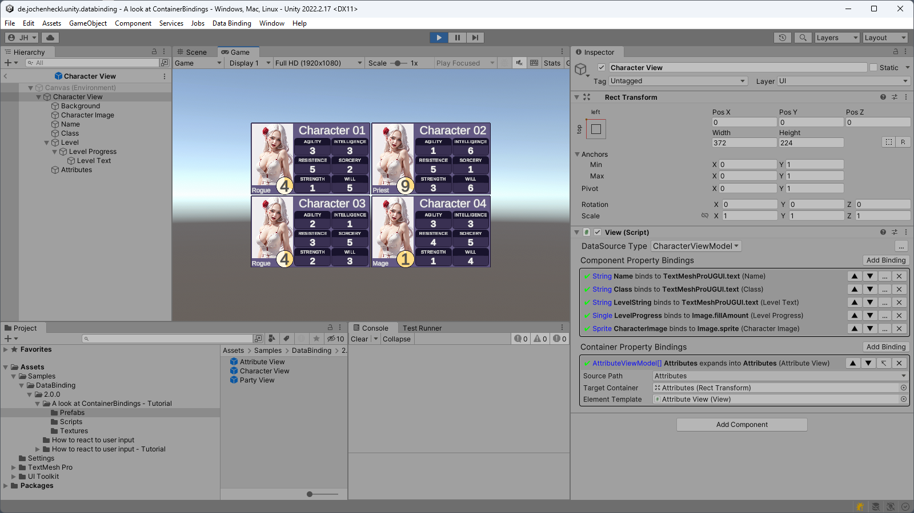
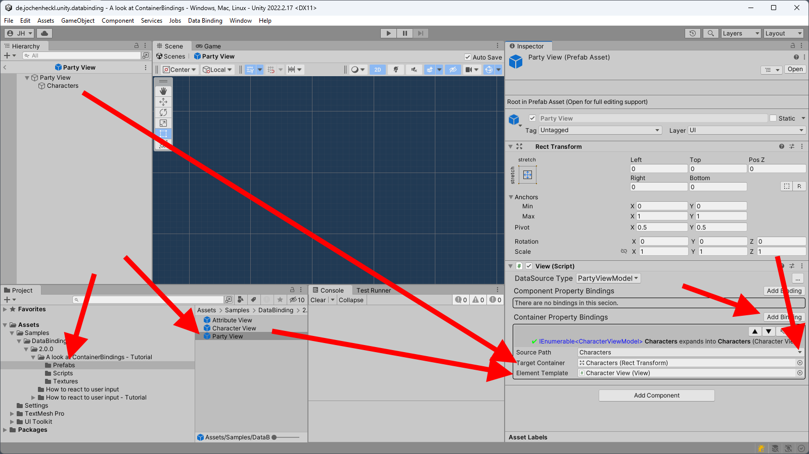
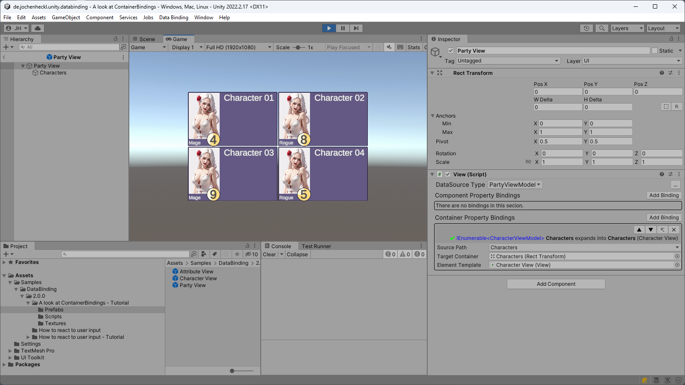
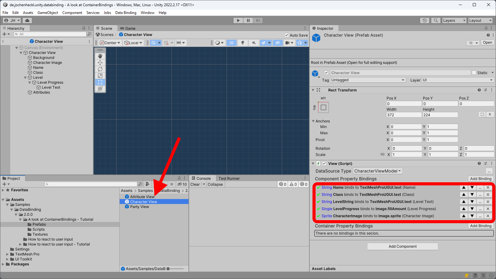
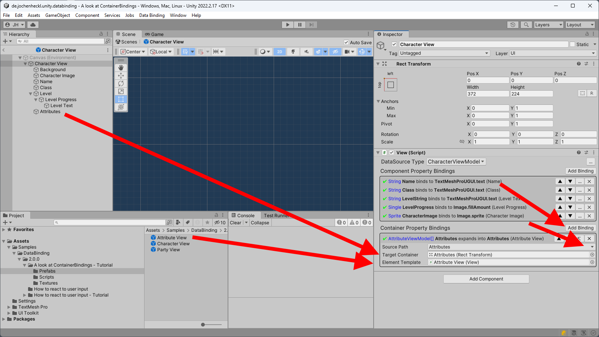

# A look at ContainerBindings

This is a short step by step tutorial that will make you familiar with container bindings.

We assume you completed the "Getting Started" tutorial and have a basic understanding of what data bindings are.

## Open the tutorial project

- Open up Unity.
- Import the DataBinding package if you have not done this already. You can follow the instructions in the ["Getting Started" tutorial](../README.md) to do so.
- Open the PackageManager Window ( Menu: Window ⟶ Package Manager ) and select the DataBinding package.
- From the samples on the right select and import **"A look at ContainerBindings - Tutorial"**.
- Back in unity open the "A look at ContainerBindings" scene.
- Running the sample renders an empty screen. But we will make it look like this:
  
  

  with just 2 small setups.
  
## Binding the Party View to display Characters
- The Project already contains some code in Bootstrap.cs that generates random data for 4 characters. The data is exposed by the ParyViewModel's Charcters property.

    <details>
    <summary>Show code</summary>
    
    ```csharp
    using System.Collections.Generic;

    namespace IC.DataBinding.Examples.ContainerBindings
    {
        public class PartyViewModel : DataSourceBase<PartyViewModel>
        {
            public IEnumerable<CharacterViewModel> Characters { get; set; }
        }
    }

    ```
    </details>
    
- What we are trying to achieve, is to display character data in the Party View. So lets open the **Party View** prefab. (*Hint: Typing 'Party V' in the search bar of our Project Window can help you find it faster*)
  
  

- Now add a new Binding by clicking the **Add Binding** button in the **Container Property Bindings** section of your Inspector window.
- Select the **SourcePath** property to bind to the Characters property of your PartyViewModel. The editor will limit your choices to **IEnumerable** properties only. After all: This is a Container, so we expect it to hold Elements in a 1:n relationship. If we were to bind a 1:1 relationship, a Component Property Binding would do.
- As **Target Container** select the Characters GameObject from your Hierarchy (It is already set up to show a Grid for our purpose).
- Now finally, as we are binding 1:n, we have to supply an **Elememnt Template** that will be used to represent each element of the IEnumerable property in the scene. To do this, drag the **Character View** prefab into the **Element Template** binding input area. *(Hint: You can find the **Character View** prefab right next to the **Party View** prefab that you are current editing. If not you maybe have the Party V filter still active.*)

- If you click run now you should be a scene like this:

    

- Note that the **Character View** prefab itself is a **View** with it's own property bindings that become evaluated for each of the **CharacterViewModel**s that are stored in the **Characters** Property of the **PartyViewModel**.

    

    
## Binding the Charcter View to display Attributes

Attributes are for Characters pretty much what Characters are for the Party. There is a 1:n relation of Characters:Attributes. Characters *'contain'* Attributes. So we go create a ContainerBinding:

  

- Select the **Attributes** property of the CharacterViewModel as **Source Path** of the Binding.
- Drag the **Attributes** GameObject into the **Target Container** inputArea. (*Hint: Just as with **Character View**s the **Attribute** GameObject is properly set up as Grid already.*)
- Drag the **Attribute View** prefab into the **Element Template** input are.
- Click Play and you should see the final result.


