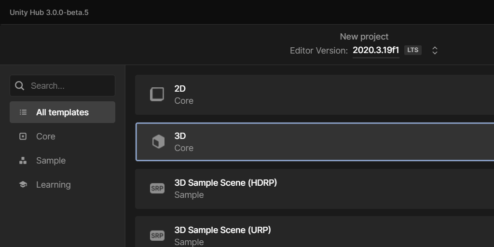
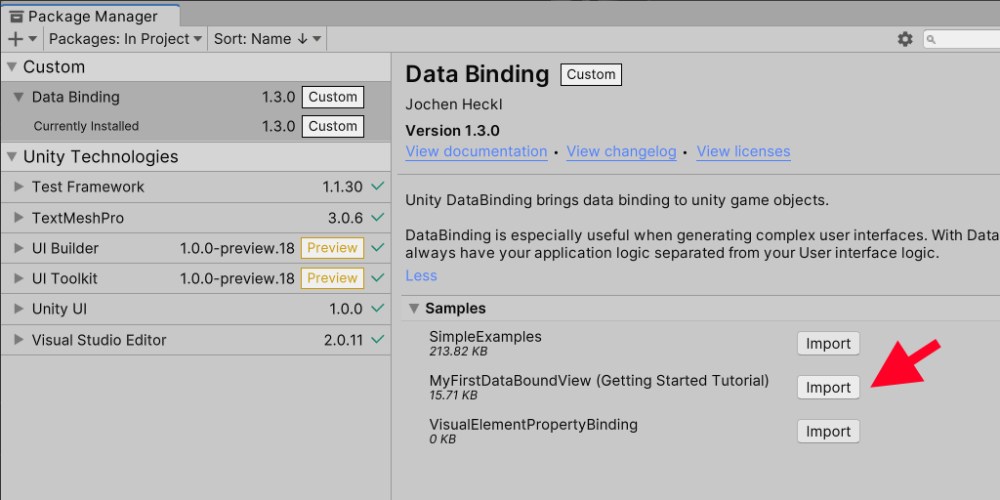
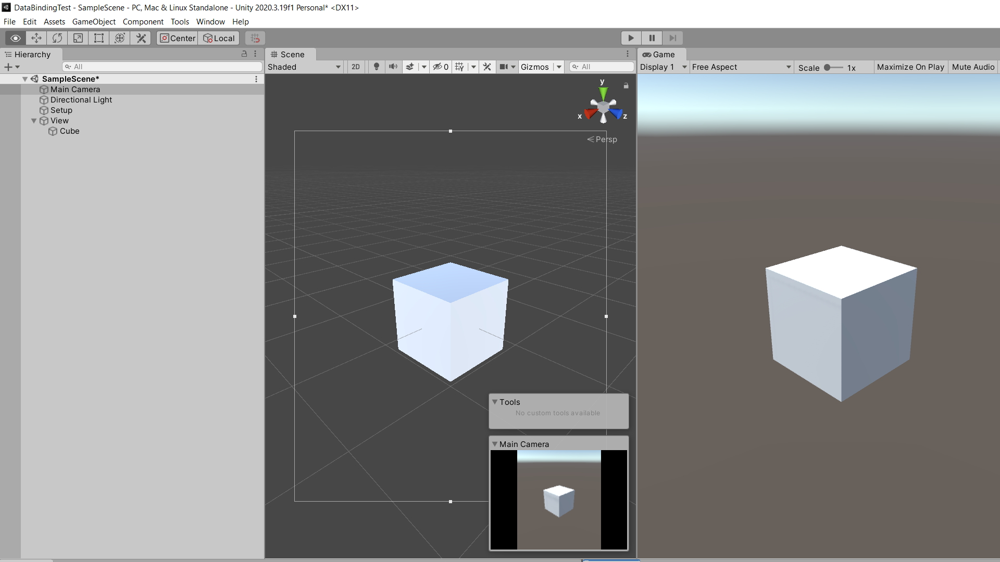
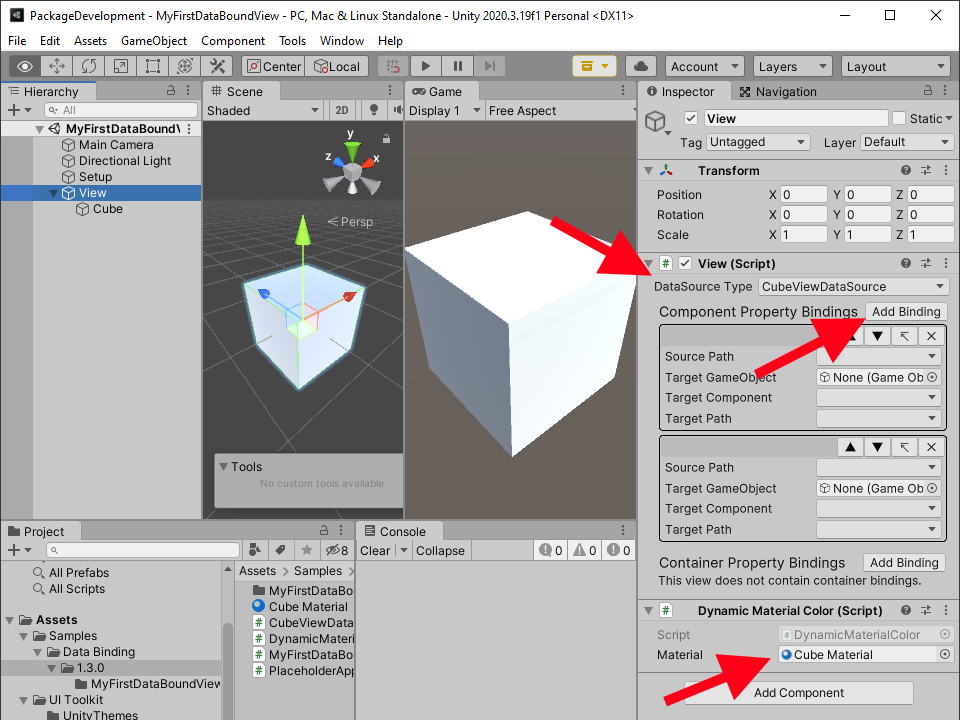
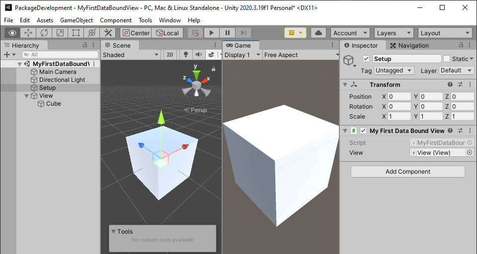
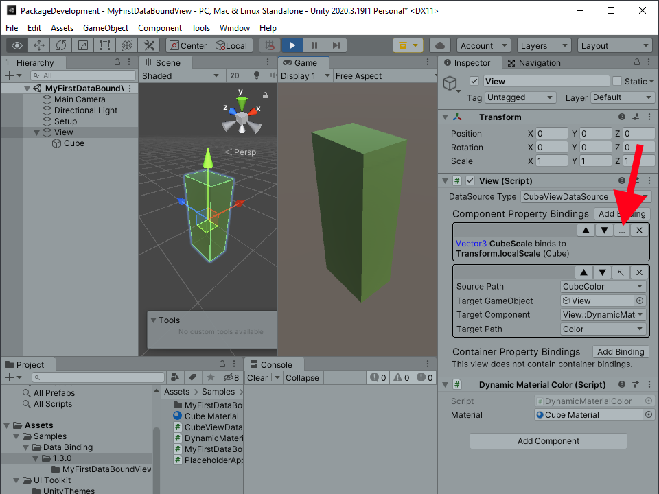

# Unity DataBinding

## What is Unity DataBinding?

Unity DataBinding brings data binding to unity game objects. DataBinding is aiming to minimize the effort required to create dynamic, performant user interfaces.

With DataBinding you will always have your application logic separated from your User interface logic.

## Getting started (Step by Step Tutorial - 5 minutes to complete)

### Installing the package

- Open Unity and create a new Unity Project.

  It does not matter which kind of Unity project you choose DataBinding works with all flavours of Unity. For simplicity we will choose 3D Core.

  

- Install the data binding package using the Unity Package Manager [Installing a package from a Git URL](https://docs.unity3d.com/Manual/upm-ui-giturl.html) from here:
  
  >[https://github.com/JochenHeckl/DataBinding.git](https://github.com/JochenHeckl/DataBinding.git)
  
  *If you should lose track after completing this step you can simply skip to the end by loading the MyFirstDataBoundView sample*

  

- If you want to use this package with Unity versions older than 2021.2 you also need to add the packages:
  - com.unity.ui  
  - com.unity.ui.builder

### Setting up the scene

- Add a New GameObject and name it `Setup`
- Add a New GameObject and name it `View`
- Right click the View GameObject and add a 3D Cube to it.
- Select the cube and **double tap the 'f' key** to focus the cube.
- Select the Main Camera and hit **CTRL + SHIFT + 'f'** to align the camera.
  
  Your scene should look something like this:
  
  

- Create a new c# script ***CubeViewDataSource.cs***:
  
  <details>
  <summary>Show code</summary>

  ```csharp
  using de.JochenHeckl.Unity.DataBinding;
  using UnityEngine;

  public class CubeViewDataSource : DataSourceBase<CubeViewDataSource>
  {
    public Vector3 CubeScale { get; set; } = Vector3.one;
    public Color CubeColor { get; set; } = Color.grey;
  }
  ```

  </details>

- Create a new c# script ***PlaceholderApplicationLogic.cs***:

  <details>
  <summary>Show code</summary>

  ```csharp
  using UnityEngine;

  /// <summary>
  /// This class is here as a replacement for whatever
  /// application logic your application might implement.
  /// You application might be arbitrarily complex and expose
  /// many data sources - static data sources as well as dynamic ones.
  /// This application is about changing the scale and color of a cube.
  /// That's it for this tutorial.
  /// So the sole data source exposed is a simple CubeViewDataSource.
  /// </summary>
  public class PlaceholderApplicationLogic
  {
    public CubeViewDataSource CubeViewDataSource { get; set; }
    private float _nextCubeUpdateTimeSeconds;

    public void Initialize()
    {
        CubeViewDataSource = new CubeViewDataSource();
        _nextCubeUpdateTimeSeconds = 0f;
    }

    public void Update(float simulationTimeSeconds)
    {
        if ( _nextCubeUpdateTimeSeconds < simulationTimeSeconds )
        {
            _nextCubeUpdateTimeSeconds += 3.0f;

            CubeViewDataSource.NotifyChanges(x =>
            {
                x.CubeScale = Vector3.one + Random.insideUnitSphere;
                x.CubeColor = Random.ColorHSV(0, 1, 0, 1);
            });
        }
    }
  }
  ```

  </details>

- Create a new c# script ***MyFirstDataBoundViewSetup.cs***:
  
  <details>
  <summary>Show code</summary>

  ```csharp
  using de.JochenHeckl.Unity.DataBinding;
  using UnityEngine;

  public class MyFirstDataBoundViewSetup : MonoBehaviour
  {
    public View view;
    private PlaceholderApplicationLogic _placeholderApplicationLogic;
    public void Start()
    {
        _placeholderApplicationLogic = new PlaceholderApplicationLogic();
        _placeholderApplicationLogic.Initialize();

        view.DataSource = _placeholderApplicationLogic.CubeViewDataSource;
    }

    // Update is called once per frame
    public void Update()
    {
        _placeholderApplicationLogic.Update(Time.time);
    }
  }
  ```

  </details>

- Create a new c# script ***DynamicMaterialColor.cs***:

  <details>
  <summary>Show code</summary>
  
  ```csharp
  using UnityEngine;

  public class DynamicMaterialColor : MonoBehaviour
  {
      public Material material;      
      public Color Color
      {
          set
          {
              var meshRenderer = GetComponent<MeshRenderer>();
              meshRenderer.material.color = value;
          }
      }
  }

  ```

  </details>

- Create a Material for the Cube.
  From the Menu select *Assets* --> *Create* --> *Material*. Name the Material "Cube Material" and drag it onto the Cube in your scene view.

### Configuring the ***View*** GameObject

- Select the View GameObject and click the Add Component button.
  Type "View" into the search bar. Add a View Component.
- Choose CubeViewDataSource as the DataSource Type for this view.
- On the View component add two component property bindings by clicking the Add Binding button twice.
- Add a DynamicMaterialColor Component to the CubeGameObject.
  


- Now we are set to configure the two component property data bindings:
  
  - Select the ***Source Path*** for the first binding to be ***CubeScale***
  - The ***Target GameObject*** will be the ***Cube*** GameObject.
  - For the ***Target Component*** choose ***Cube::Transform***
  - The ***Target Path*** will be ***localScale***
  - Select the ***Source Path*** for the second binding to be ***CubeColor***
  - The ***Target GameObject*** will be the ***Cube*** GameObject.
  - For the ***Target Component*** choose ***Cube::DynamicMaterialColor***
  - And finally the ***Target Path*** will be ***Color***

  If the component property binding is valid, it will collapse to a condensed text description. You can toggle expanded and collapsed view
  using the ```…``` and ```↸``` toggle button.

### Configuring the ***Setup*** GameObject

- Add the MyFirstDataBoundViewSetup component to the Setup GameObject.
- Link the View GameObject to the View property of MyFirstDataBoundViewSetup.

In a real world scenario we would not *hard code* this relation but generate the view from some prefab. However this approach is very handy to develop views in isolation.



### Running the Project

- That's it! We are done. Hit play and you should see the application logic change the appearance of the cube every other second.




## FAQ

### **Question:**

My Project looks like this. What Do I do?

- 
  
### **Answer:**

Your most likely use the Universal Render Pipeline (URP) in your Unity Project, but the example was made using the built in render pipeline. [Upgrade material and shaders to use the Universal Render Pipeline](https://docs.unity3d.com/Packages/com.unity.render-pipelines.universal@12.1/manual/upgrade-guides.html).