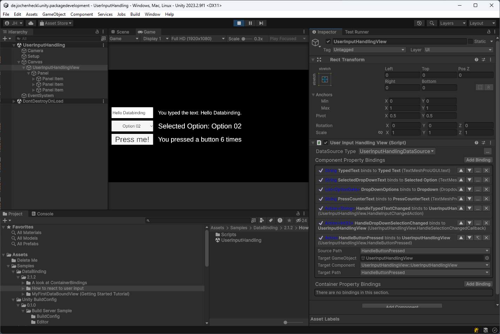

## Unity DataBinding

### What is Unity DataBinding?

DataBinding is a method of connecting a data model with user interface components, allowing changes in one to automatically reflect in the other.

This package supplies the means that will enable you to implement declarative user interfaces (== user interfaces that are a function of the underlying data that defines it). It's like WPF for Unity Game Objects. 

### Tutorials

- [Getting Started](Documentation~/GettingStarted.md) (Detailed Step by Step Tutorial - 5 minutes to complete)
  
  

   Create a simple scene showing a cube that randomly changes scale and color. This tutorial will make you familiar with fundamental ideas of this tool.

   ---

- [How to react to user input](Documentation~/HowToReactToUserInput.md) (Step by Step Tutorial - 5 minutes to complete)
  
  

  Starting from a simple scene that renders some input controls fill in the blanks that makes user input available to your application logic.
  
  ---

- [A look at ContainerBindings](Documentation~/ALookAtContainerBindings.md) (Step by Step Tutorial - 5 minutes to complete)

  

  Concerning user interface tool sets:  When it comes to handling not just static but dynamic content is where the wheat is separated from the chaff. Starting with some basic prefabs you will put together a nice little party panel for your characters in this tutorial.